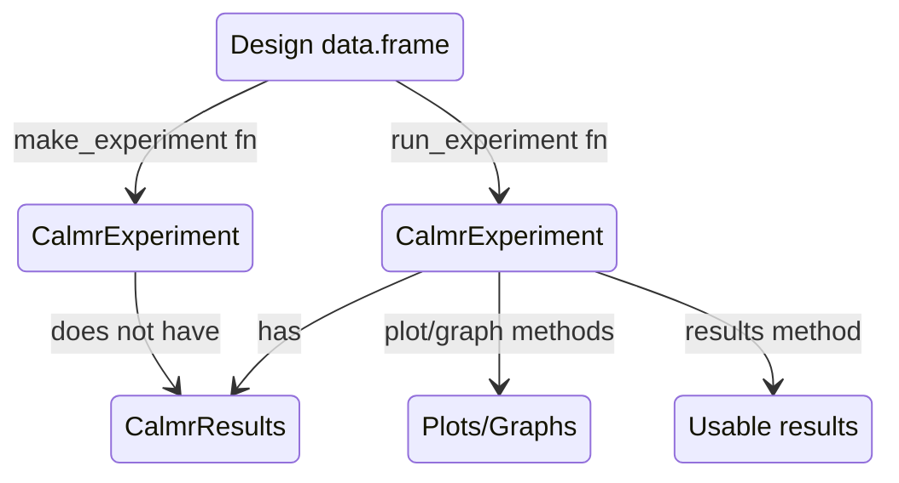

I spent a good part of last week refactoring my [calmr](https://victornavarro.org/calmr) package. The whole thing was motivated by creating an *add-on* package that included time-based models. Funnily enough, while developing this new package, I found myself rewriting some of the core functionalities in the base package so as to make them flexible enough to accommodate both trial- and time-based models. It did not work.

After a week of hair-pulling, I've finalized all changes and merged the experimental branch into the main branch of the [github repository](https://github.com/victor-navarro/calmr).

### A calmr calmr

In the refactor, I rewrote some of the S4 classes. The CalmrModel class plays a less pivotal role; it has been superseded in importance by the CalmrExperiment class. In fact, pretty much everything revolves around experiments now. Here is a little flow diagram that explains the current organization.

The diagram above encapsulates the two biggest use cases for the package: 1) running quick simulations, and 2) model fitting.

If you just want to get a quick and dirty simulation, you can make your way through with a design `data.frame`, a model string, and the `run_experiment` function.

If you are in the business of model fitting. Then you can precompute experiment arguments using `make_experiment` and pass that to your model function.

I think I finally got the hang of generic methods, so I've renamed many of the clumsy calmr_*something* functions into just *something*. I've also added some getter and setter methods not shown above. For example, the `parameters` method for CalmrExperiment objects will return a list of the parameters for the experiment (which otherwise is accessible at experiment@arguments$parameters). More importantly, calling `parameters(experiment) <- new_parameters` lets you set the parameters for the experiment whilst tricking you into thinking `experiment` is mutable.

### Extra stuff

##### More tests
The previous version of the package had around 40 tests, and now it is sitting close to 90! I cannot emphasize enough how important these tests were, and how satisfying it is to go from 20 to 80 passed tests by fixing one single line of code.

##### More flexibility
The package now seamlessly supports many models in an experiment, thanks to the `c` method for `CalmrExperiments`. Just run two experiments (or better yet, use the `compare_models` function) and the results will include many models per output. This functionality was key for fixing the methods associated with representational similarity analysis (I really need to write an article about that).

##### Simpler app
With the refactor of the main package, I had to refactor the `calmr` `shiny` app. I did a pass on the janky HTML code for the header and reorganized some of the widgets. I reactivated the app's sidebar and threw some of the options there. I also removed some of the options to maintain simplicity.

### The last 10% takes 90% of the time
At some point, I was happy enough to merge the experimental branch into the main branch. All tests passed. Documentation built correctly. Vignettes were knitted. The website was ready and so were the `gh-pages` actions.

And so I pushed.

And the website failed to deploy.

The logs disclosed an obscure `pak` error with nothing else than a `failed to build source package` message. I install my local copy of the package using pak with no trouble, but installing from the freshly pushed repository failed with the same message. You hate to google an error and see another person asking a similar question, alas, with no solution on the horizon.

So this is for you, in case you google has brought you here. I am sure this is unlikely to be what's happening with your pak installation.

In my case, I renamed some R/ files to their lowercase version (i.e., RSA.R to rsa.R). The `Collate` field in the `DESCRIPTION` file of the package does not automatically update and `devtools` kept throwing warnings, so I modified it by hand. Yet, when I merged the experimental into the main branch, the `DESCRIPTION` file was changed accordingly, but the R files I modified did not. That was the whole problem, hidden by `pak`, and revealed by `devtools::build()`. So, one file renaming latter, the website was online.
